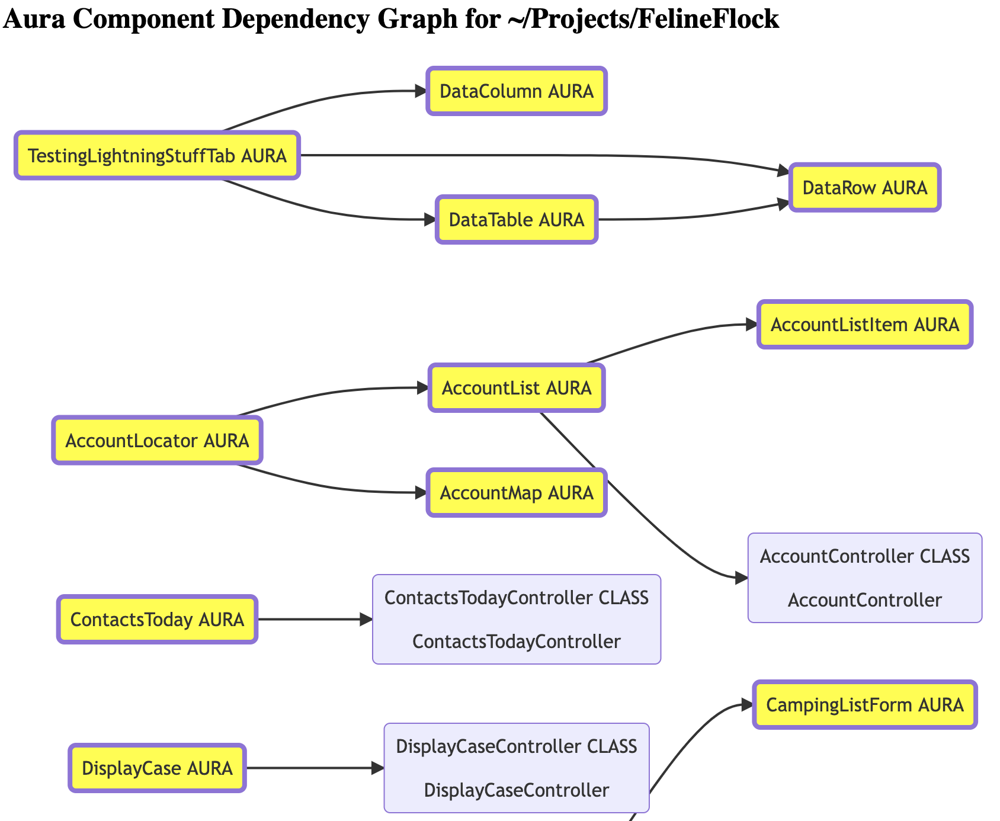
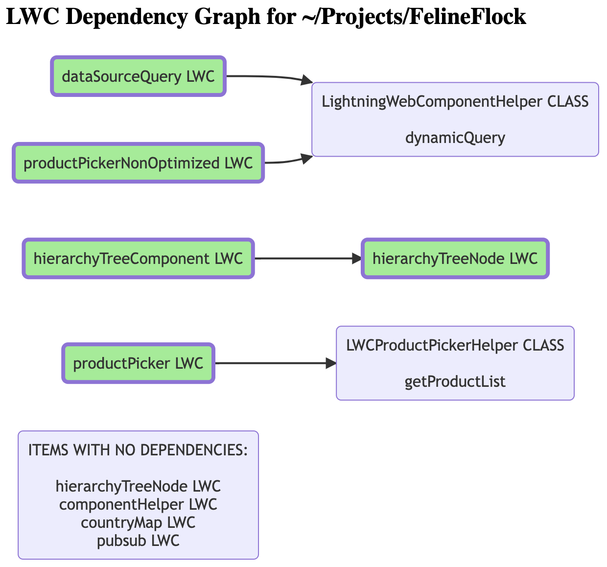
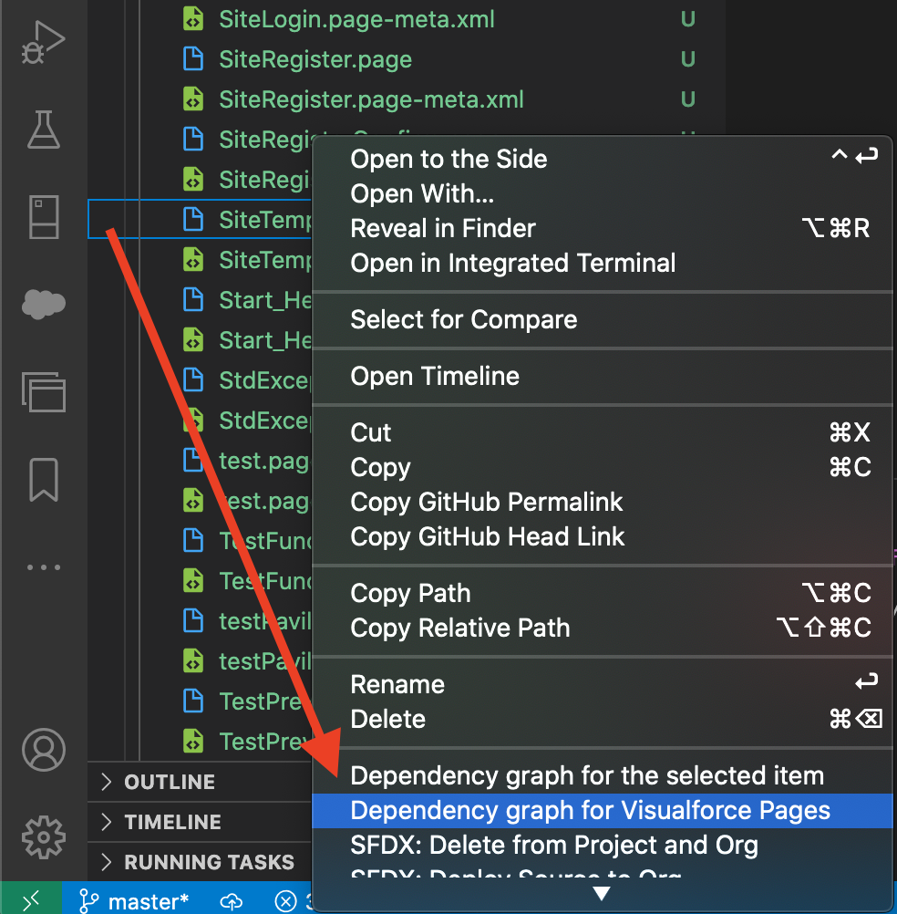

# Dependency Graph for Salesforce

This extension scans the Salesforce metadata and code stored in /force-app/main/default to extract class/method names and find dependencies between them then opens a dependency graph in an HTML page using Mermaid JS.

## Features

This extension will open a dependency graph for the selected type of element.

Activate with Ctrl + Shift + P or right click a folder or file then select one of the "Dependency graph..." options.

Dependency graph for Aura components

Dependency graph for Apex Classes

Dependency graph for Lightning Web Components

Dependency graph from the right click context menu

## Requirements

The metadata must have been downloaded and available in the folder /force-app/main/default using "SFDX: Retrieve Source from Org".

## Extension Settings

This extension has no settings to configure.

## Known Issues

Sometimes when you open the same graph twice in a row, the graph is displayed slightly different. This seems to be related to the sort order.

## Release Notes

### 1.0.4

New icon

### 1.0.3

Increased maximum number of dependencies and added context menu items and ability to display the graph for only one item with all its dependencies

### 1.0.2

Replaced the Node "open" package - it sometimes does not get installed properly for some reason

### 1.0.1

Added issue reporting GitHub template

### 0.0.1

Initial release of Dependency Graph for Salesforce