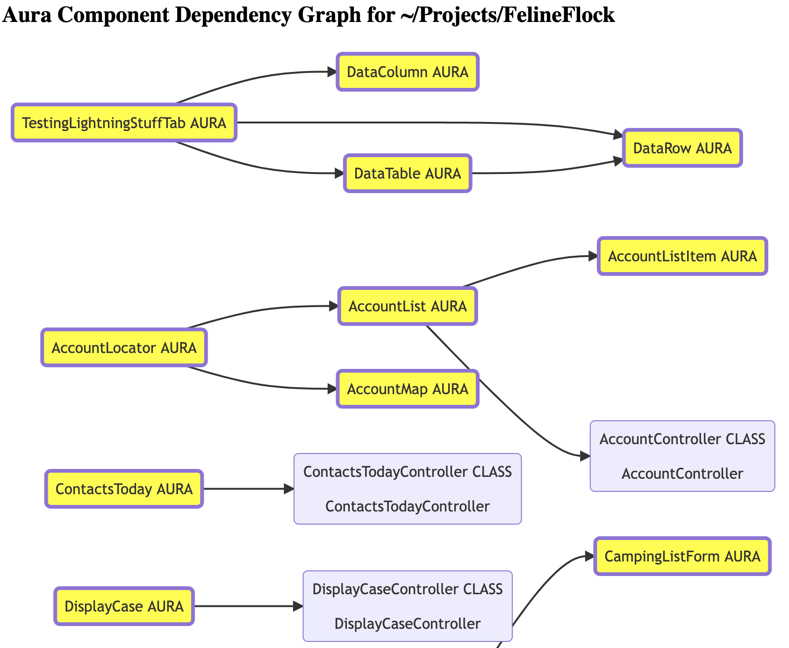
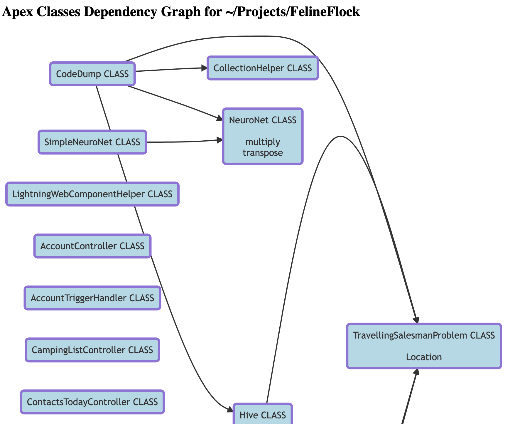
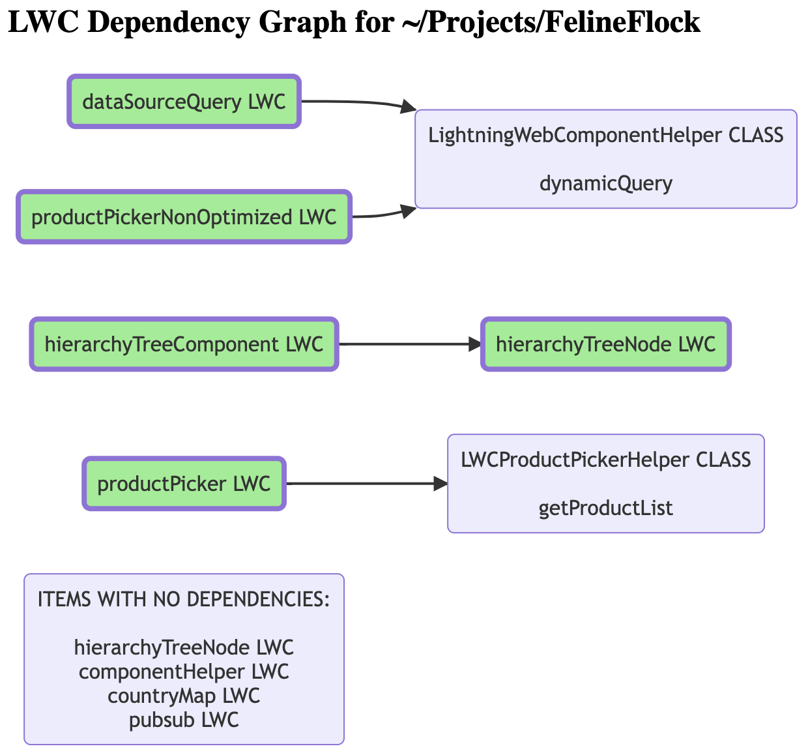
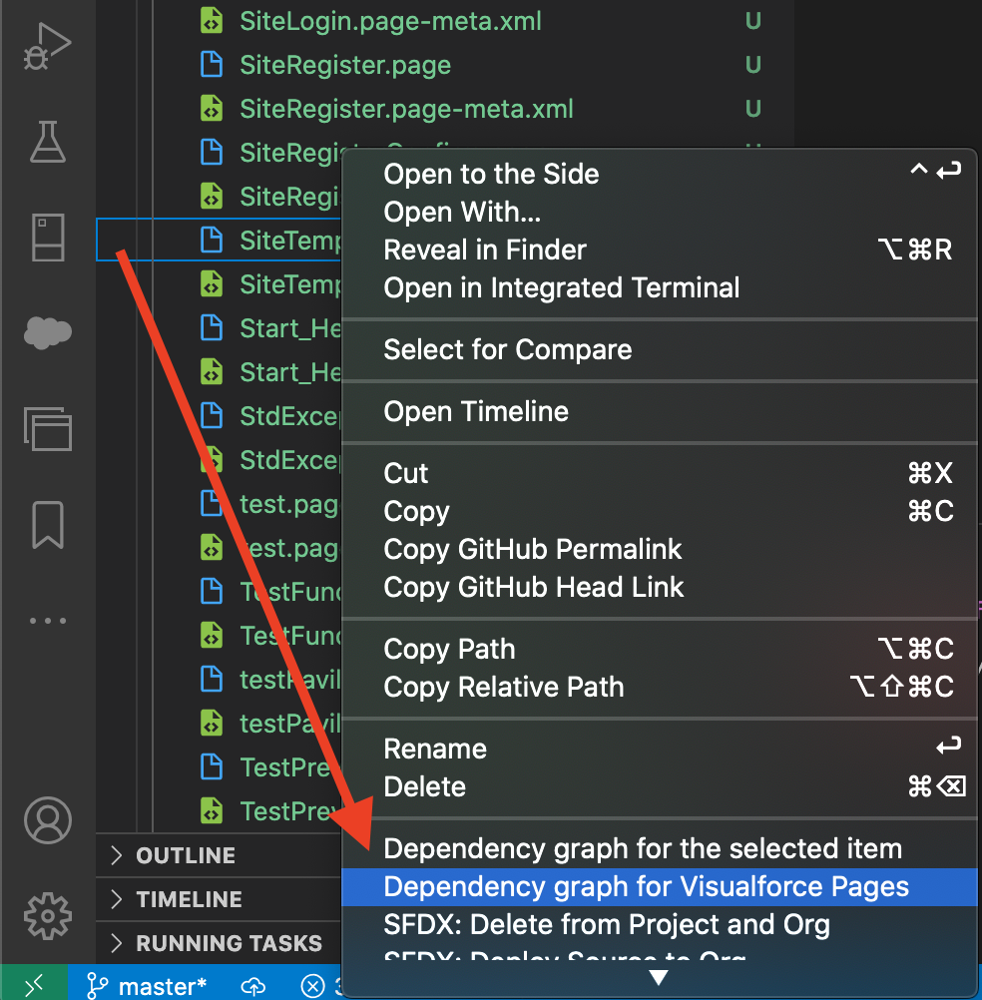

# Dependency Graph for Salesforce

This extension scans Salesforce metadata and code to extract class/method names and find dependencies between them, then opens a dependency graph in an HTML page using Mermaid JS.

Source folders are discovered automatically: the extension reads `sfdx-project.json` and scans every package directory listed in it (mono-repos with multiple packages are supported), falling back to `/force-app/main/default`. You can also set the folders explicitly in the settings.

## Features

This extension will open a dependency graph for the selected type of element: Apex Classes, Apex Triggers, Flows, Lightning Web Components, Aura Components and Visualforce Pages/Components.

Activate with Ctrl + Shift + P or right click a folder or file then select one of the "Dependency graph..." options.

- **Graph opens inside VS Code** — the graph renders in an editor tab (webview). Set `renderIn` to `browser` for the previous behavior of opening an HTML file in your browser.
- **Clickable nodes** — clicking a node opens the corresponding source file (beside the graph when in the webview).
- **Search/filter box** — type in the toolbar to fade out non-matching nodes.
- **Export SVG/PNG** — toolbar buttons save the graph as an image for docs and wikis.
- **Depth control** — the selected-item graph includes items up to `selectedItemDepth` hops away (default 2); set it to 1 for direct dependencies only.
- **Flows calling Apex** — invocable action calls and Apex-defined types in flows are detected and labeled on the edge.
- **Triggers show their sObject** — trigger graphs include an `on` edge to the sObject the trigger fires on (light green cylinder).
- **Packaged flows are excluded** — flows from managed packages (names with a `namespace__` prefix) are filtered out so they don't clutter the big picture.
- **Multi-package projects** — all `packageDirectories` from `sfdx-project.json` are scanned and merged into a single graph, so cross-package dependencies show up.

Dependency graph for Aura components

Dependency graph for Apex Classes

Dependency graph for Lightning Web Components

Dependency graph from the right click context menu

### Internal dependency graph for a single class

Right click a `.cls` file and select **"Internal dependency graph for this class"** to see the dependencies *inside* the class:

- Method → method call edges show which methods call which.
- Cylinder nodes represent sObjects: `read` arrows come from SOQL queries, `write: insert/update/delete/upsert` arrows come from DML statements (including `Database.insert()` style calls).
- Clicking a method node opens the class file at that method's line in VS Code.

## Requirements

The metadata must have been downloaded and available locally, e.g. using "SFDX: Retrieve Source from Org". By default the extension looks at the package directories listed in `sfdx-project.json`, or `/force-app/main/default` when that file is absent.

## Extension Settings

Open Settings → Extensions → DependencyGraphForSF (or search for `dependencygraphforsf` in the settings):

| Setting | Default | Description |
|---|---|---|
| `dependencygraphforsf.renderIn` | `webview` | Where to display the graph: `webview` opens an editor tab inside VS Code; `browser` writes `dependencyGraph.html` to the project root and opens the default browser. |
| `dependencygraphforsf.selectedItemDepth` | `2` | How many hops away from the selected item to include. `1` shows only direct dependencies/dependents. |
| `dependencygraphforsf.dependencyLimit` | `700` | Maximum number of dependency edges to render. Increase for larger orgs (may slow browser rendering). |
| `dependencygraphforsf.minConnections` | `0` | Minimum total connections (inbound + outbound) required for an item to appear in the graph. Set to `2` to hide leaf nodes and reduce clutter in large orgs. `0` shows everything. |
| `dependencygraphforsf.sourceFolders` | `[]` | Explicit list of source folders to scan, relative to the project root (e.g. `["my-package/main/default"]`). Overrides the automatic `sfdx-project.json` detection. Leave empty for auto-detect. |

When a graph hits the dependency limit, the page header suggests ways to reduce clutter: scope the graph to a single item via right-click, or raise `minConnections`.

## Known Issues

None currently. (The earlier issue where the same graph rendered differently on consecutive runs was fixed by deterministic sorting and per-run cache clearing.)

## Release Notes

### 1.1.1

- Graph opens in a VS Code webview panel (configurable via `renderIn`)
- Search/filter box and SVG/PNG export buttons in the graph toolbar
- Depth control for the selected-item graph (`selectedItemDepth`)
- Flows calling invocable Apex are detected and labeled
- Triggers show an edge to the sObject they fire on

### 1.1.0

- New: internal dependency graph for a single Apex class (method → method calls, sObject reads via SOQL, writes via DML)
- New: clickable nodes open the source file in VS Code
- New: multi-package folder discovery via sfdx-project.json, with `sourceFolders` setting override
- New: `dependencyLimit` and `minConnections` settings to manage large graphs
- Packaged (managed) flows are excluded from graphs
- Fixed: LWC graph from js-meta.xml context menu did not generate
- Fixed: graphs rendered differently on consecutive runs (deterministic sort + cache clearing)
- Fixed: large graphs could appear clipped (render-complete detection instead of fixed delay)
- Automated test suite (58 tests)

### 1.0.10

Fixed handling of folder names in Windows appearing as ///c%3a

### 1.0.9

Fixed handling of folder names with spaces

### 1.0.8

Better detection of non-method references, refactoring and new tests

### 1.0.7

Enhanced the seeking of dependencies when an item is right-clicked

### 1.0.6

Bug fix for Windows version

### 1.0.5

Enhanced code that parses method calls to work better with Mermaid JS

### 1.0.4

New icon, dependency graph for single item now includes "grandparents" and "grandchildren" dependencies, adjusted compatibility with VSCode 1.60 and later versions

### 1.0.3

Increased maximum number of dependencies and added context menu items and ability to display the graph for only one item with all its dependencies

### 1.0.2

Replaced the Node "open" package - it sometimes does not get installed properly for some reason

### 1.0.1

Added issue reporting GitHub template

### 0.0.1

Initial release of Dependency Graph for Salesforce
